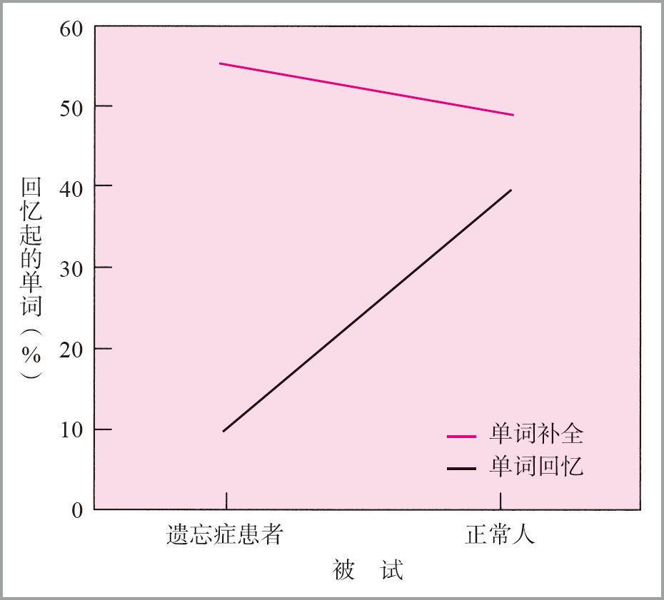

# HM实验

>（资料来源：Graf，Squire，& Mandler，1984．Reprinted by permission of the publisher．©1984 by the Journal of Experimental Psychology：Learning，Memory，and Cognition .）

这个实验比较了遗忘症被试和正常被试回忆所学单词的能力以及补全残缺的所学单词的能力。在回忆单词任务中，遗忘症被试的表现比正常被试差很多。但是在单词补全任务中，遗忘症被试和正常被试之间没有差异。

Ref：《认知心理学及其启示 第 7 版》P218 图 7.13

**验证观察存在外显记忆、内隐记忆。**

Day：210121 19:38
