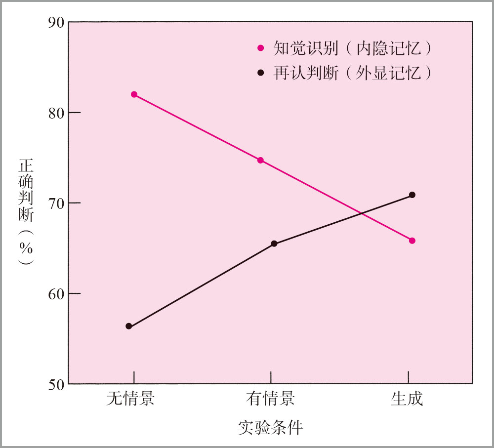

# 雅阁比实验

>（资料来源：Jacoby，1983．Reprinted by permission of the publisher．© 1983 by the Journal of Verbal Learning and Verbal Behavior .）

雅各比的实验结果表明，一些变量对外显记忆和内隐记忆的影响不同。实验对比了在记忆测验中再认一个词的能力和在知觉测验中识别这个词的能力，它们作为最初学习这些单词的方式的函数显示在图中。

Ref：《认知心理学及其启示 第 7 版》P219 图 7.14

**正常被试验证观察存在外显记忆、内隐记忆。**

Day：210121 21:30