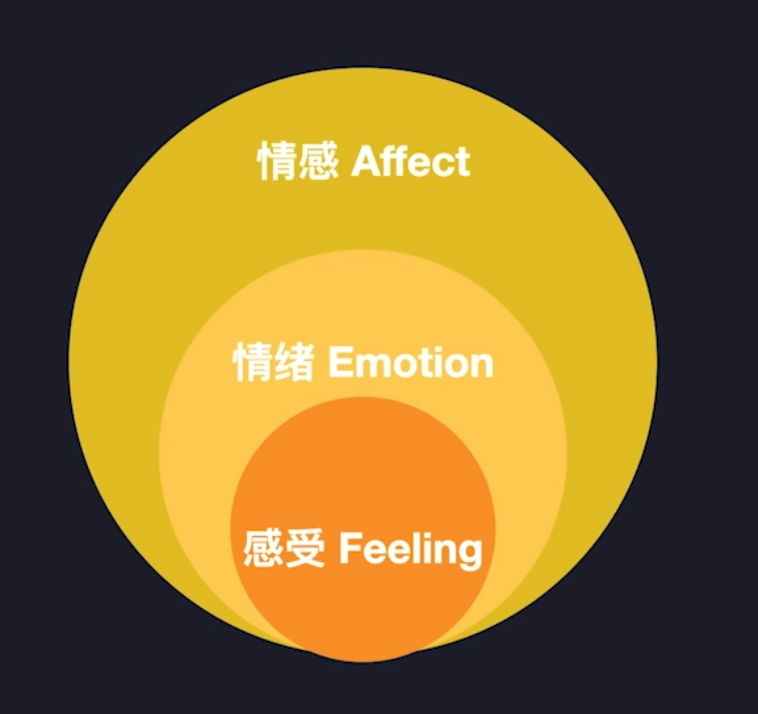

# 情绪（Eemotion）

情绪心理学（The Psychology of Emotion）心理学定义

>(1) 情绪是包含主观体验(心里状态)、外部表现（表情、身体、语言）和外周生理唤醒（呼吸、心率）的心理状态集合体。

>(2) 情绪是人类心理模型的一项关键特征。

参考线索

- [Emotion - Wikipedia](https://en.wikipedia.org/wiki/Emotion#Definitions)
- [Mood (psychology) - Wikipedia](https://en.wikipedia.org/wiki/Mood_(psychology))
- [Emotion (journal) - Wikipedia](https://en.wikipedia.org/wiki/Emotion_(journal))
- [情绪 - 维基百科，自由的百科全书](https://zh.wikipedia.org/wiki/%E6%83%85%E7%BB%AA)
- [情感 (心理学) - 维基百科，自由的百科全书](https://zh.wikipedia.org/wiki/%E6%83%85%E6%84%9F_(%E5%BF%83%E7%90%86%E5%AD%B8))
- [Psychology of Emotion - Google 学术搜索](https://scholar.google.com.sg/scholar?q=Psychology+of+Emotion&hl=zh-CN&as_sdt=0&as_vis=1&oi=scholart)
- [THE PSYCHOLOGY OF EMOTION - Google 学术搜索](https://scholar.google.com.sg/scholar?q=THE+PSYCHOLOGY+OF+EMOTION&hl=zh-CN&as_sdt=0&as_vis=1&oi=scholart)
- [情绪心理学 - 读书 - 豆瓣搜索](https://search.douban.com/book/subject_search?search_text=%E6%83%85%E7%BB%AA%E5%BF%83%E7%90%86%E5%AD%A6&cat=1001&start=15)

**容易混淆的概念**

>情感（Affect）：是情绪、感受或感情等类现象的统称，即适用于人类，也适用于动物

>感受（Feeling）：是情绪的主观体验，通常用于人类的社会性高级感情

Day：210418