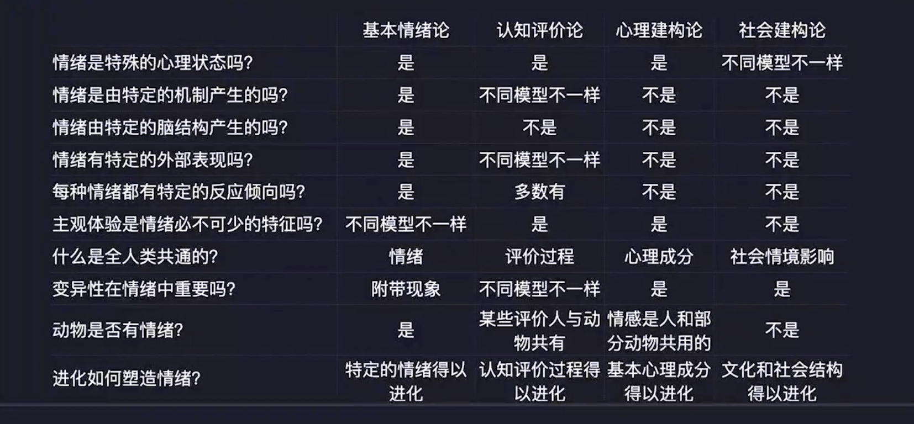

# 情绪心理学发展历史

## 心理学诞生之前

**笛卡尔的身心二元论**

17~18 世纪，笛卡尔的身心二元论在情绪理论界占主导地位。

他认为，情绪是人的内在经验，产生于心灵之中，并且情绪不是心灵的主动状态和功能，它必须由外部环境激发。外部信息传递到心灵，心灵做出判断后，将信息传递到身体，身体做出反应

只有人类才有情绪经验，尽管动物能做样的身体反应，动物没有情绪。

**达尔文的情绪进化论**

他认为，情绪是人类行为得以延续的机制，情绪是进化的高级阶段的适应工具。

从进化论角度指出人与其他动物在同连续体之中，在情绪上具有延续性，并认为面部表情只是伴随情绪的附属物，表情本身并没有进化，它们不依赖于自然选择。

## 现代四个流派


- 基本情绪论：受达尔文影响（面部表情编码系统）某些观点已被推翻。
- 心里建构论：前沿
- 社会建构论：前沿

**四个流派的核心假设**



## 前沿进展

最前沿两大重要方向

- 情绪建构论
- 积极情绪

**情绪建构论**

>Lisa Barrett 丽莎-巴瑞特

情绪建构论融合了**心理建构论、社会建构论和神经建构论**。

核心观点

```
每种情绪有不同的生理表征，变异性是常态。怒时你可能会一声不吭，或者大喊大叫。
情绪根据复杂的神经建构，而不是特定的神经通路
情绪是不是进化而来，而是大脑建构的体验，是大脑对你身体发生的事情的理解。
```

**积极情绪**

>芭芭拉弗雷德里克森 Barbara Fredrickson
- [积极情绪的力量 (豆瓣)](https://book.douban.com/subject/35314376/)
  - <zotero://select/items/0_XC55WRXJ>
- [积极情绪的力量 (豆瓣)](https://book.douban.com/subject/5398985/)
- [爱的方法 (豆瓣)](https://book.douban.com/subject/25981848/)
  - <zotero://select/items/0_UK64Q7SB>

扩展和建构理论。表明积极情绪拓展了人瞬时的思想和行动能力，形成持久的个人资源。

```
快乐激发了玩耍的欲望
兴趣激发了探索的欲望
满足激发了品位和融洽的欲望
爱激发了亲密和安全关系的循环
```

Day:210418