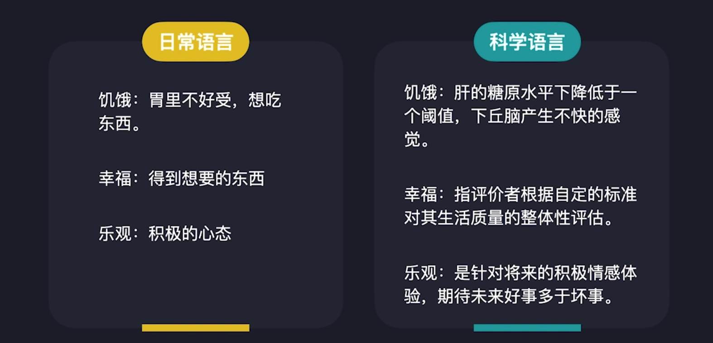
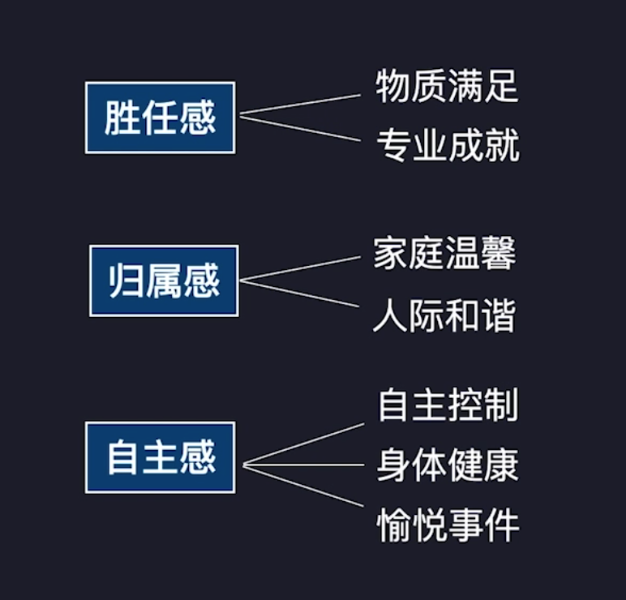

# 如何学习积极情绪

## 难点：日常语言 VS 科学语言

日常语言

>个性的、模糊的依赖直觉与感觉

科学语言

>可重复、可检验的系列操作而非事件

相互矛盾的日常语言

**流行的错误常识**

- 低自尊会导致学业不良。
- 我们只用了 10%的大脑功能。
- 左脑从事逻辑思维，右脑从事形象思维。
- 做多选题时，即使对所选答案感到不确定，也千万不要更改最初的答案。

解决：操作主义

## 将科学知识应用日常生活

心理学的危机：实验效应难以重复

>在发表的关于社会行为的研究中，很多实验无法重复研究结果。比如经典的棉花糖实验和斯坦福监狱实验。

2018 年，Camerer 等人选取了 21 项发表在 Science 和  Nature》上的关于社会行为的研究，结果仅成功重复了其中 13 项。

心理学家 Brian Nosek 带领 200 名心理学家组成的国际化团队，尝试重复 28 个心理学研究的结果，仅有 14 项研究成功重复。

**解决：变量三范式**

幸福的变量三范式

- 幸福的定义：指评价者根据自定的标准对其生活质量的整体性评估
- 幸福的分类：主观幸福感与幸福表现行为
- 哪些变量影响幸福：自主感、胜任感、归属感
- 幸福影响哪些变量：寿命、健康

去改变可以改变的变量。

解决：情绪颗粒度

Day：210418