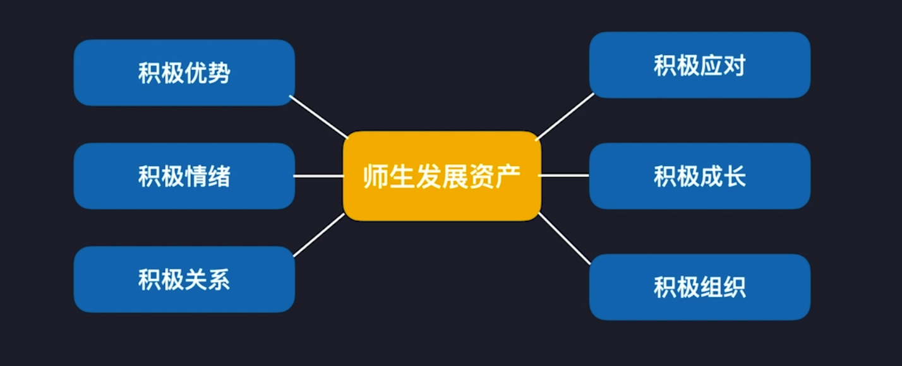

# 积极心理学

## 什么是积极心理学？

积极心理学是研究人的优势与幸福的一门心理学学科。它着眼于建立：

- 1.积极的情绪
- 2.积极的个人特质、
- 3.积极的组织机构。

积极心理学通过快乐、参与和意义来帮助人们通往幸福与快乐。

## 积极心理学的诞生标志

2000 年，塞林格曼和契克森米哈赖在《美国心理学家》发表论文（Positive psychology: An  introduction》，标志着积极心理学的诞生

## **代表人物**

- 塞林格曼
- 契克森米哈赖
- 彼德森

```
积极心理学之父：马丁・塞林格曼
1998 年最高票当选为美国心理协主席，为积极心理学奠定了结构体系。

重要理论：习得性无助

出版了 21 本著作，发表了 200 余篇相关论文。
```

```
米哈里·契克森米哈赖
匈牙利美国心理学家，积极心理学学科重要开创者。

重要理论：心流

共著有近 300 篇学术论文，共引用 83816 次，h 指数为 50
```

```
克里斯托弗·彼德森
密歇根大学心理学教授，曾担任临床心理学主席，《积极心理学》杂志顾问编委国际积极心理学会秘书长，编写了积极心理学教材。

在积极心理学领域，谷歌学术引用排名第 4, 共引用 74997, h 指数 110。
```

## **核心期刊**

- 幸福研究杂志
- 积极心理学期刊
- 国际积极心理学会刊

中国重要研究机构（办公室主任：赵昱銀）
- 清华大学积极心理学研究中心

**积极心理学教材**

- [打开积极心理学之门 (豆瓣)](https://book.douban.com/subject/26747845/)
- [积极心理学 (豆瓣)](https://book.douban.com/subject/25763661/)
- [积极心理学 (豆瓣)](https://book.douban.com/subject/2329651/)

## **核心话题**

- 积极情绪
- 积极个人特质
- 积极组织

**积极心理学的分类框架**

积极的情绪

- 过去的积极情绪体验（幸福、满意）
- 现在的积极情绪体验（心流、品味）
- 未来的积极情绪体验（希望、乐观）

积极的个人特质

- 个人优势测验
- 自我效能、自我决定论、同理心

积极的组织
- 心理资本

**极心理学框架应用**



课程重点放在，优势、情绪、关系、组织。

- 积极应对：在逆境中反弹的能力
  - 行动心理学
- 积极成长：自我决定论，动机
  - 动机心理学

## **积极心理学不足**

发展心理学家杰罗姆（Jerome Kagan）的批评

```
1) 定义含糊不清。
2) 积极心理学的干预技巧效果是短暂的、有限的。
3) 道德的悖论：部分人的快乐来自欺骗他人以及犯罪。
```

- [三种文化 (豆瓣)](https://book.douban.com/subject/25998509/)
- [人性火花 (豆瓣)](https://book.douban.com/subject/26351466/)

追求积极情绪的悖论

- 对积极情绪渴望程度越高的，反而情绪更低落，主观幸福感水平越低
- 追求积极情绪享乐幸福比感受生活意乂而实现幸福，会损害心理学健康
- 追求积极情绪通常重视享乐和个体目标的达成，而关注个人目标容易导致对过于自我关注，进而变得更孤独

Day:210418