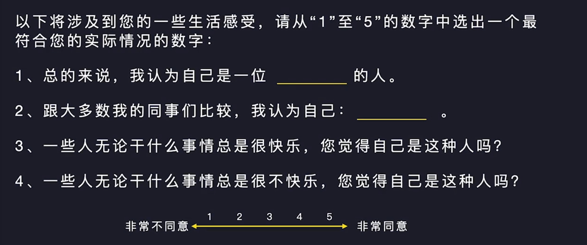
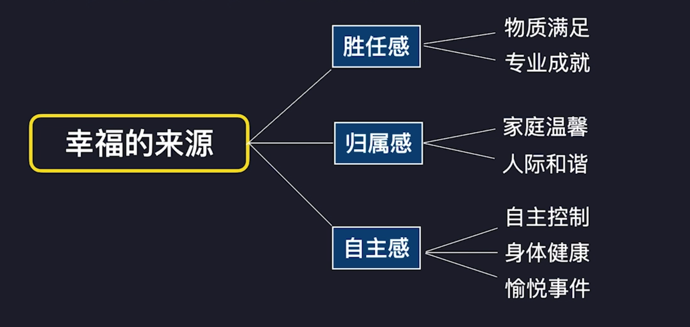
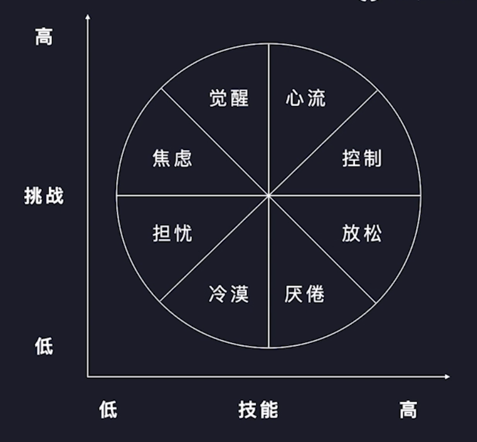
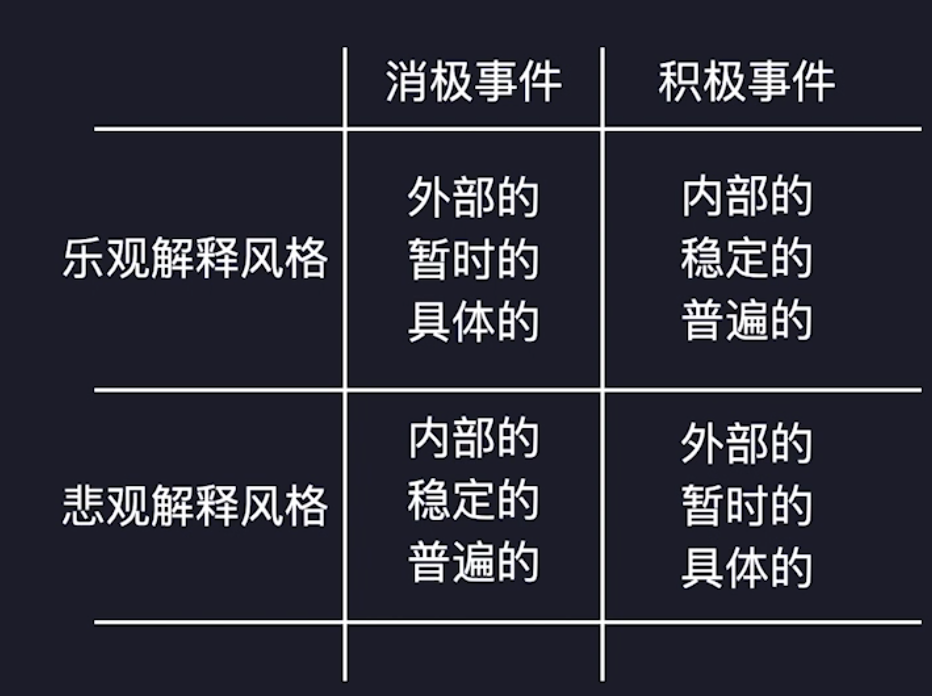

# 积极情绪

[积极心理学](210418-积极心理学.md)与情绪心理学交集

情绪心里学

- [情绪](../CARD/210418-情绪.md)
- [情绪分类](../CARD/210418-情绪分类.md)
- [情绪心理学发展历史](../CARD/210418-情绪心理学发展历史.md)

解決情绪题的三种常见方法

- 独处
- 亲朋好友
- 心理咨询师

常见方法的弊端

- 过度关注消极情绪
- 较少使用积极情绪

积极心理治疗

从人可能发展的潜力出发，强调人的优势美德。

- 关注积极的情绪
- 关注积极的人格特质

古代人好的方法，观大海，临大江，登高山。

**科学验证：胜利者效应**

>2017 年，浙江大学神经科学研究中心的胡海岚团队在《科学》发表《胜负经历重塑丘脑到前额叶皮层环路以调节社会竟争优势》文章，指出大脑中存在一条介导“胜利者效应”的神经环路，先前的胜利经历，会让之后的胜利变得更加容易。

成功是成功之母：成功的经历会改大脑中的神经连接，让等级较低的小鼠逆袭

## 积极情绪研究

弗雷德里克森·芭芭拉积极情绪分类(拓展建构理论)

喜悦\自豪\感激\逗趣\宁静\激励\兴趣\敬佩\希望\爱

### 时间维度的积极情绪分类

**过去：主观幸福感**

迪纳是享有盛誉的幸福研究者，被称为“幸福博士”，提出过 GNH（国民幸福指数）的概念，以下是他对主观幸福感的定义

主观幸福感，指评价者根据自定的标准对其生活质量的整体性评估。

主观幸福感的特点

- 主观性
- 稳定性
- 整体性

阳志平：主观幸福感自评量表

主观幸福感与幸福表现行为

**现在：心流**

“心流”是指我们在做某些事情时，那种全神贯注、投入忘我的状态，你甚至感觉不到时间的存做有挑战且擅长的事情的时候，

就很容易体验到心流，比如爬山、游戏、阅读、工作。

**未来：乐观与希望**

乐观：是针对将来的积极情感体验。当一个人把某种社会性的未来或物质性的未来期望视为社会上需要的、对他有利的或能为他带来快乐的，那么与这种期望相关联的心境或态度就是乐观。

希望：是一种朝向目标的思想，包括途径思想和意志思想两部分，分别表示个体能寻找到实现愿望目标的途径和个体认识到在实现愿望目标的过程中需要意志力。

尽可能避免**习得性无助**知道成功才是成功之母，多个小成功才能有大成功。

>习得性无助是一个放弃反应，无论怎么努力都于事无补想法与行为。

>人在接连不断地受挫折后，便会感到自己对于一切都无能为力，丧失信心，陷入一种无助的心理状态。

塞林格曼：乐观解释风格

- 塞林格曼认为，乐观不是人格特质，而是一种解释风格。
- 解释风格是你对这件事为什么会这样发生的习性解释方式。
- 乐观者使用适应性因果归因解释消极事件。

Day：210418