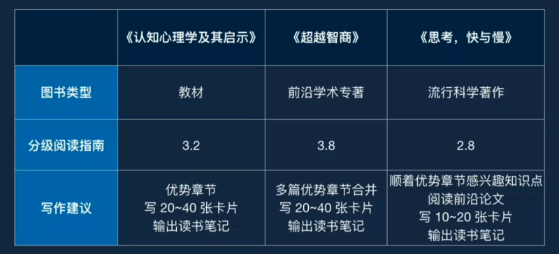

# 认知与改变

全年围绕人们的四大核心认知结构：认知、情绪、动机与行动，设计课程，帮助你更好地理解人类行为模式，识别并优化认知结构。

侧重的是了解人性，掌握大脑背后的秘密。

## 教学计划

- 日历：[课程组提供订阅链接](https://p26-caldav.icloud.com/published/2/NDc1MDQ4MDQyNDc1MDQ4MM5zPn5IY8c9Xu8svPESJYzDbOcgTIKJ2PJQFICYTBF1-O2KYxPCNqxeeF1bAYPGAtDIbbu01hQTY4RMVJZwb34)

## 学习计划

- [学习节奏](CONTENT/210216-学习节奏.md)
- 跟随课程教学计划，按时完成作业

学习机会：

- 周/教练分享
- 月/主题串讲 + 示范读书方法论
- 季/专家分享

第一季度：

## 各渠道分享

- M1W2：教练答疑分享 [阅读方法论：如何提出问题？](CONTENT/210121-M1W2：教练答疑.md)
- M1W4：教练答疑分享 [教材阅读实践](CONTENT/210131-M1W4：教练答疑.md)

## 课程内容

- [开学典礼](CONTENT/开学典礼.md)
  - 教练：
- [开课综述](CONTENT/开课综述.md)
- 结业典礼

### 第一季度

- [季度综述](CONTENT/季度综述.md)
- M1：《认知心理学及其启示》第 7 版 | [在线阅读](http://reader.epubee.com/books/mobile/1b/1becb7e39bd2de0ad33fef12275f1747/text00001.html)
  - 抽样阅读
  - 阅读挑战
- M2：《超越智商》
  - 阅读挑战：[任务/作业](CONTENT/210202-M2挑战及任务.md)
  - 如何阅读学术专著？：[如何阅读学术专著注意事项](CONTENT/210202-如何阅读学术专著.md)

## 作业

### M1

- M1W1：[PQ4R](CONTENT/210121-M1W1基础-PQ4R.md) | [阅读第一章](CONTENT/210121-M1W1基础-阅读第一章.md) | [信息加工范式](CONTENT/210121-M1W1选修.md)
- M1W2：[工作记忆](CONTENT/210121-M1W2基础.md) | [记忆与生活](CONTENT/210121-M1W2选修.md)
- M1W3：[阅读第七章](CONTENT/210121-M1W3选修.md)
- M1W4：[读书笔记](CONTENT/210121-M1W4notes.md)

### M2

- M2W1：[双过程理论](CARD/210203-双过程理论.md) | [三重心智模型](CARD/210206-三重心智模型.md) | [吃透三重心智模型]()
- M2W3：[理性该如何分类？](CARD/210216-理性分类.md) | [认知吝啬鬼](CONTENT/210217-认知吝啬鬼.md) | 贝叶斯

## Changelog

- 210216 add 学习节奏
- 210203 add M2W1 作业双过程理论
- 210202 add M2 如何阅读学术专著、任务/作业、学习机会
- 210131 add M1W4 教练答疑
- 210121 add M1 作业；M1W2：微明教练分享
- 210103 create 认知与改变